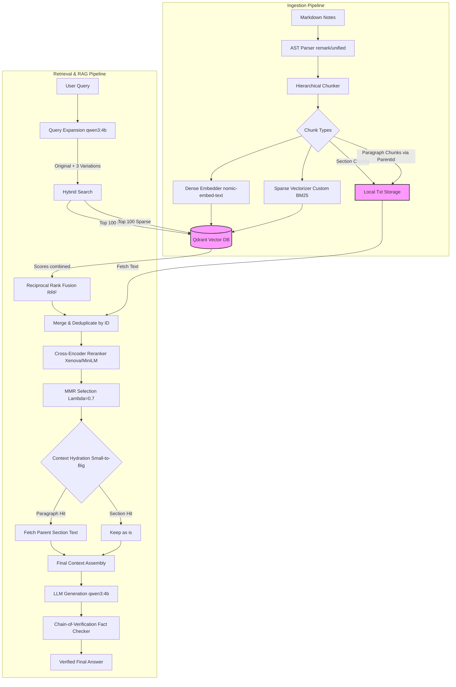

# AetherOS High-Level Design (HLD)

This diagram visualizes the architecture of AetherOS, split into the **Ingestion Pipeline** (how notes are processed and stored) and the **Retrieval Pipeline** (how quotes are found and answers are generated).

## Key Workflows:
1. **Ingestion**: Markdown is intelligently parsed to preserve structure. Chunks are embedded both semantically (Dense) and lexically (Sparse), then stored in Qdrant while the raw text is saved to disk for fast, lightweight hydration.
2. **Retrieval**: The system queries 4 variations of the question, fetches vector hits, merges them via RRF, re-scores them accurately with a Cross-Encoder, filters for diversity using MMR, and finally "zooms out" on small paragraphs to give the LLM full necessary context.
