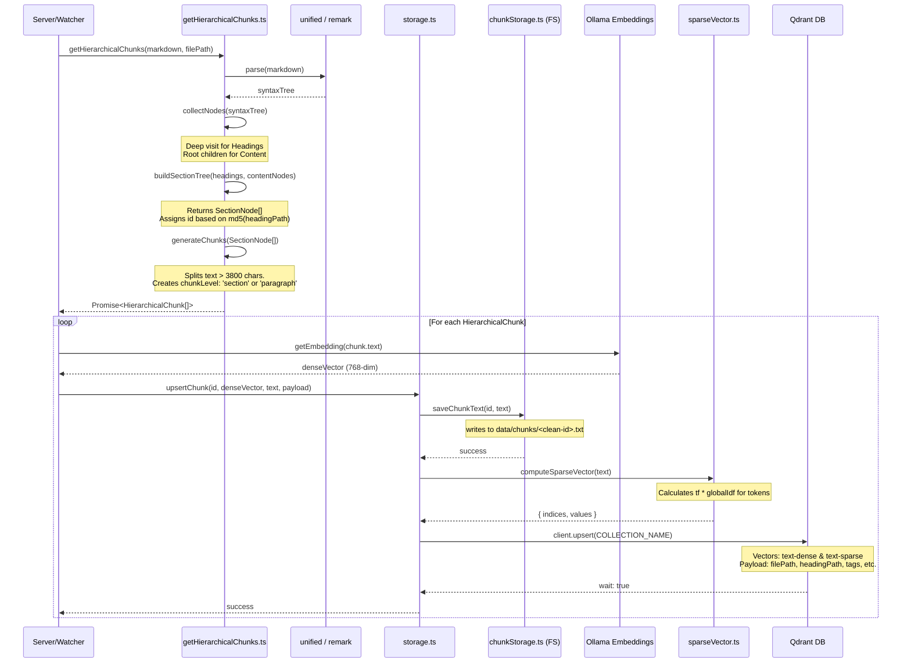
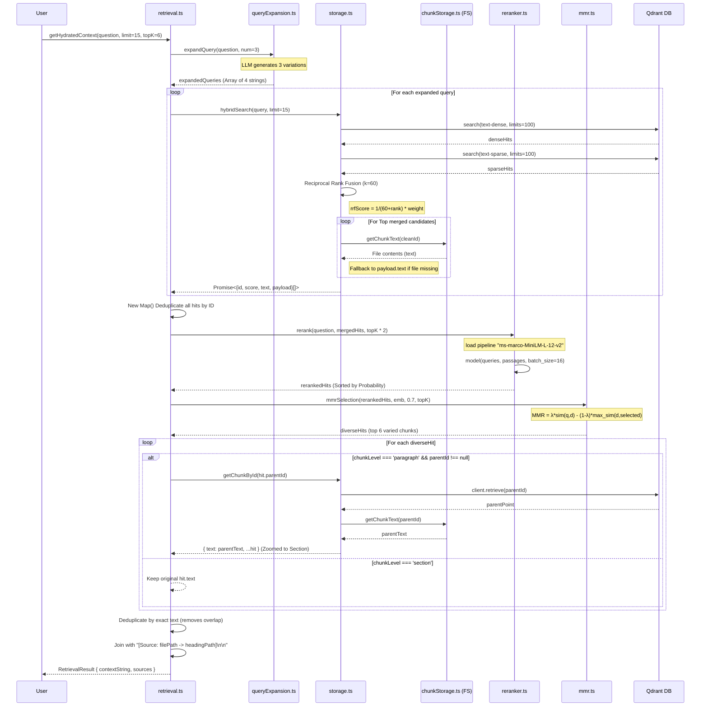

# AetherOS Low-Level Design (LLD)

This document visualizes the exact sequence of function calls, data structures, and service interactions in the AetherOS codebase. It is split into two sequence diagrams representing the two primary lifecycle events: **Document Ingestion** and **RAG Retrieval**.

## 1. Document Ingestion Flow

This sequence details how `getHierarchicalChunks.ts` processes raw markdown and persists it through `storage.ts`.

## 2. RAG Retrieval Engine Flow

This sequence details the execution of `getHydratedContext` within `retrieval.ts`.

### Advanced Algorithmic Notes Included:
* **Reciprocal Rank Fusion**: By performing calculations purely in memory in `storage.ts`, it negates complex DB-side scoring calculations. It scales both query hits inversely to their rank index.
* **Small-to-Big Retrieval Optimization**: Hydrating using `chunkLevel` prevents the final payload from overflowing token limits with duplicate content while still feeding the LLM maximum viable context.
* **Batch Inference**: The cross-encoder limits processing bottlenecks by batching its inputs explicitly for vector execution `batch_size: 16`.
